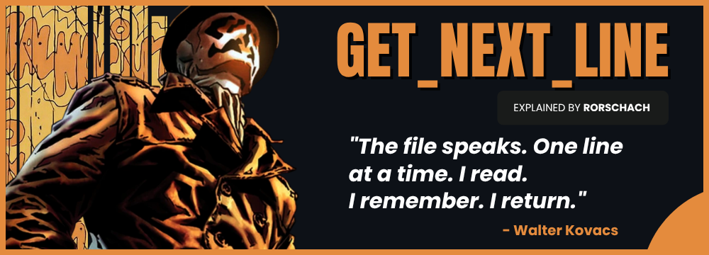
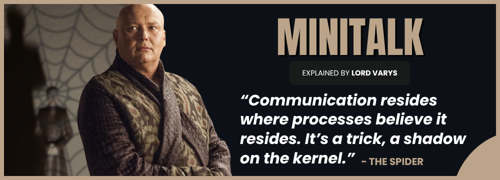
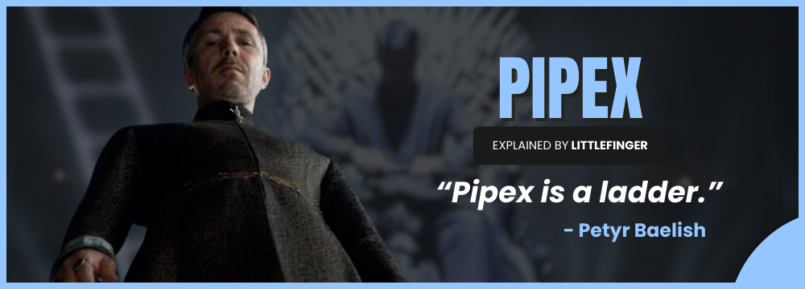
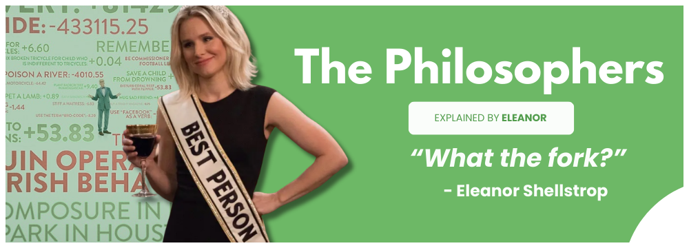
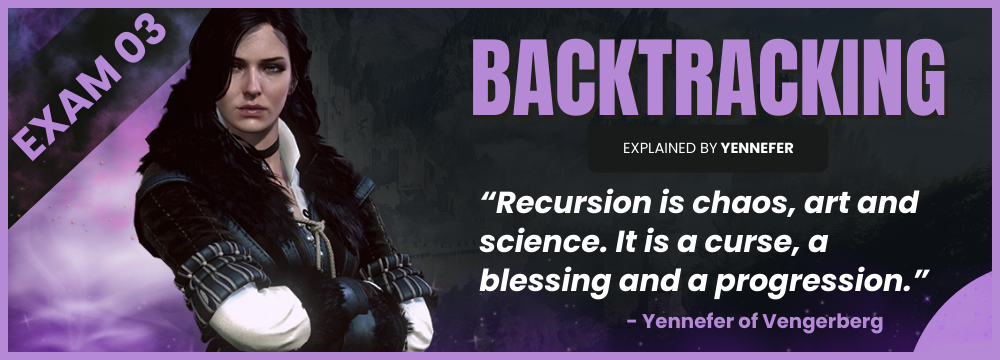

# 42 Projects: The "Explained By" collection

Welcome to my personal breakdown of the 42 common core projects where each project is narrated by iconic characters.\
Instead of just reading about the projects requirements, **experience** them through personas that match their logic.

> [!NOTE]
> All projects follow 42's Norm V3 compliance.\
> There are visuals for each project below. Just click to dive into each repo.

---

  

  

  

  

  

  

  

  

  

<h3>
<a href="https://github.com/baderelg/baderelg/blob/main/Cursus.md">Cursus progress →</a>
</h>

---

  

